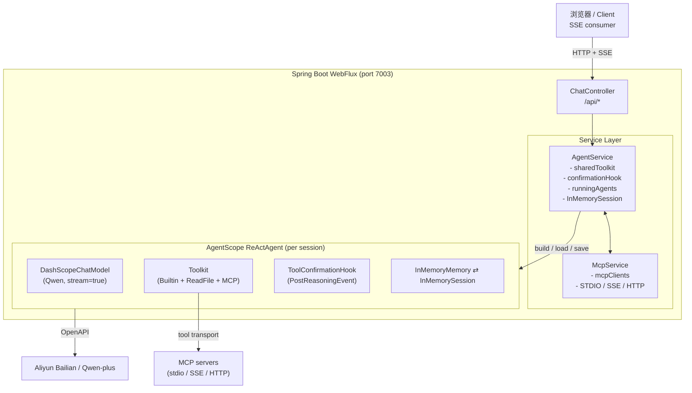
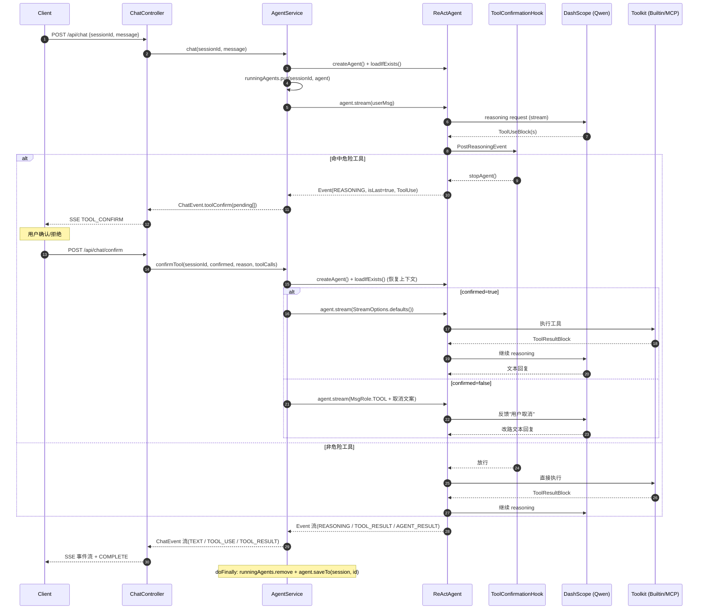
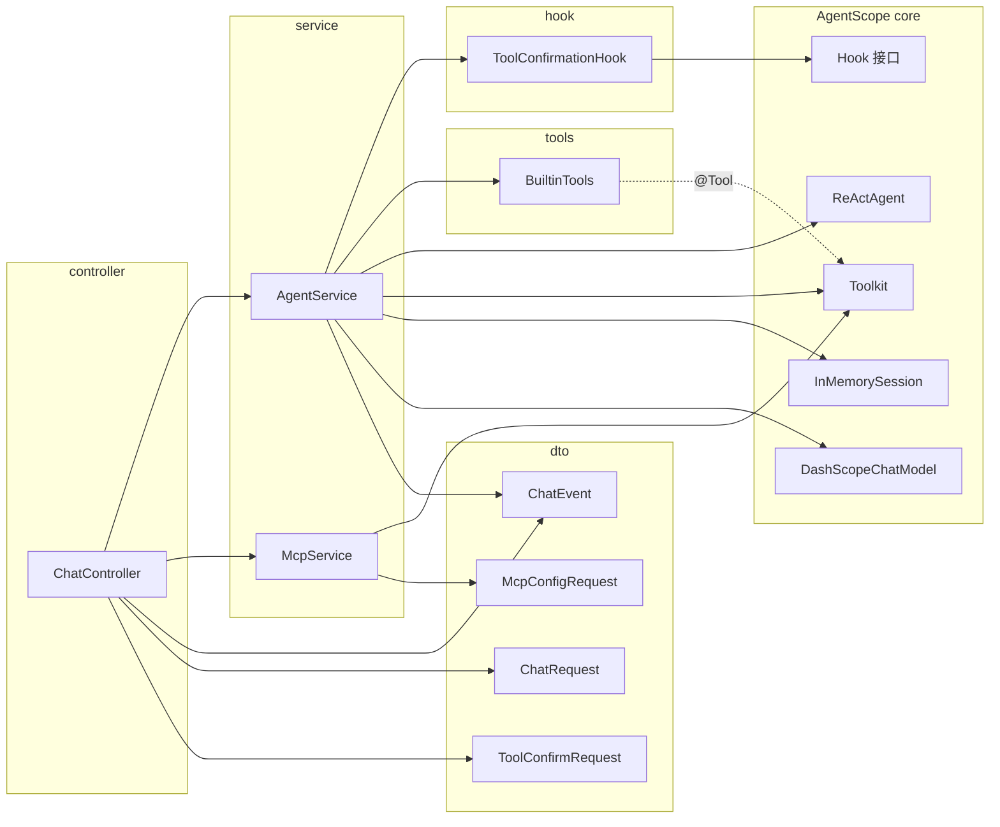

# HITL-Chat

> **H**uman-**I**n-**T**he-**L**oop Chat —— 基于 **AgentScope (Java) 1.0.10** + **Spring Boot WebFlux 4.0.1** 的人在回路对话服务示例工程。

核心演示点：把 ReAct Agent 的"工具调用前推理"通过 `Hook` 钩出，命中**危险工具清单**时停机，前端通过 SSE 收到 `TOOL_CONFIRM` 事件，用户确认后再继续推理流。

---

## 目录

- [一、技术栈](#一技术栈)
- [二、架构总览](#二架构总览)
- [三、关键流程：HITL 工具确认时序](#三关键流程hitl-工具确认时序)
- [四、组件依赖](#四组件依赖)
- [五、API 一览](#五api-一览)
- [六、SSE 事件协议](#六sse-事件协议)
- [七、运行](#七运行)
- [八、目录结构](#八目录结构)
- [九、设计要点](#九设计要点)

---

## 一、技术栈

| 维度 | 选型 |
| --- | --- |
| 语言 / JDK | Java 17 |
| Web 框架 | Spring Boot **4.0.1** + WebFlux（Reactor `Flux` / SSE） |
| Agent 框架 | AgentScope **1.0.10**（core + rag-bailian/simple + mem0/reme + studio + autocontext-memory） |
| LLM | DashScope SDK **2.15.0**，默认 `qwen-plus`，stream=true |
| 工具协议 | MCP（STDIO / SSE / Streamable HTTP） |
| 运行端口 | **7003**（`application.yml`） |

---

## 二、架构总览



> 同源 PlantUML 见 [`docs/architecture.puml`](docs/architecture.puml)，Mermaid 源 [`docs/architecture.mmd`](docs/architecture.mmd)。

---

## 三、关键流程：HITL 工具确认时序



> 同源 PlantUML 见 [`docs/sequence.puml`](docs/sequence.puml)，Mermaid 源 [`docs/sequence.mmd`](docs/sequence.mmd)。

要点：
1. `ToolConfirmationHook` 监听 `PostReasoningEvent`，命中危险工具就 `stopAgent()`，本轮 `Flux` 自然终止。
2. `confirmTool` 不复用前次 agent 实例，而是 `createAgent` + `loadIfExists` 从 session 恢复上下文，因此**确认链路无状态**、易扩展。
3. **拒绝**通过构造一条 `MsgRole.TOOL` 的 `ToolResultBlock`（取消文案）注回 LLM，让模型据此换路。
4. `doFinally` 统一收尾：移出 `runningAgents`、`agent.saveTo(session, id)`，保证状态一致。

---

## 四、组件依赖



> 同源 PlantUML 见 [`docs/component.puml`](docs/component.puml)，Mermaid 源 [`docs/component.mmd`](docs/component.mmd)。

---

## 五、API 一览

所有路径前缀 `/api`。

| Method | Path | 用途 | 入参 / 出参 |
| --- | --- | --- | --- |
| POST | `/chat` | 发送一条用户消息，开启一轮对话流 | `ChatRequest` → SSE `Flux<ChatEvent>` |
| POST | `/chat/confirm` | 危险工具确认 / 拒绝 | `ToolConfirmRequest` → SSE `Flux<ChatEvent>` |
| POST | `/chat/interrupt/{sessionId}` | 中断该 session 正在跑的 agent 流 | → `{success, interrupted}` |
| DELETE | `/chat/session/{sessionId}` | 清除会话 | → `{success}` |
| GET | `/mcp/list` | 列出已注册的 MCP server 名 | → `List<String>` |
| GET | `/tools` | 当前共享 Toolkit 中所有工具名 | → `Set<String>` |
| GET | `/settings/dangerous-tools` | 当前危险工具集合 | → `Set<String>` |
| POST | `/settings/dangerous-tools` | 重置危险工具集合 | `Set<String>` body |

> 默认危险工具：`view_text_file`、`list_directory`（在 `AgentService.init` 注入）。

---

## 六、SSE 事件协议

`ChatEvent.type` 枚举（出自 `dto/ChatEvent.java`）：

| type | 关键字段 | 含义 |
| --- | --- | --- |
| `TEXT` | `content`, `incremental` | 文本片段；`incremental=true` 表示流式增量块 |
| `TOOL_USE` | `toolId`, `toolName`, `toolInput` | 模型调用的工具（非危险，已直接执行） |
| `TOOL_RESULT` | `toolId`, `toolName`, `toolResult` | 工具执行结果 |
| `TOOL_CONFIRM` | `pendingToolCalls[]` | **HITL 关键事件**：等待用户确认的工具列表 |
| `ERROR` | `error` | 错误信息 |
| `INTERRUPTED` | `content` | 中断提示（已定义，未在 service 中触发） |
| `COMPLETE` | — | 一轮交互结束哨兵 |

`PendingToolCall` 形如：

```json
{
  "id": "call_abc",
  "name": "view_text_file",
  "input": { "path": "/etc/hosts" },
  "dangerous": true
}
```

---

## 七、运行

### 依赖准备

```bash
export DASHSCOPE_API_KEY=sk-xxxx
```

### 启动

```bash
mvn spring-boot:run
# 或
mvn package && java -jar target/hitl-chat-1.0-SNAPSHOT.jar
```

服务监听 `http://localhost:7003`。

### 简单 curl 测试

```bash
# 1. 普通对话
curl -N -H 'Content-Type: application/json' \
     -d '{"sessionId":"s1","message":"现在几点？"}' \
     http://localhost:7003/api/chat

# 2. 触发危险工具
curl -N -H 'Content-Type: application/json' \
     -d '{"sessionId":"s1","message":"读取 /etc/hosts 内容"}' \
     http://localhost:7003/api/chat
# 收到 SSE TOOL_CONFIRM 后再确认：
curl -N -H 'Content-Type: application/json' \
     -d '{"sessionId":"s1","confirmed":true,"toolCalls":[{"id":"<id>","name":"view_text_file"}]}' \
     http://localhost:7003/api/chat/confirm
```

---

## 八、目录结构

```
hitl-chat/
├── pom.xml
├── README.md                           ← 本文件
├── docs/
│   ├── architecture.mmd / .puml        架构图
│   ├── sequence.mmd     / .puml        HITL 时序图
│   └── component.mmd    / .puml        组件依赖图
└── src/main/
    ├── java/com/coderpwh/htilchat/
    │   ├── HitlChatApplication.java    Spring Boot 启动类
    │   ├── controller/ChatController.java
    │   ├── service/
    │   │   ├── AgentService.java       ReActAgent 工厂 / 会话 / 中断 / 事件转换
    │   │   └── McpService.java         MCP 客户端动态管理
    │   ├── hook/ToolConfirmationHook.java
    │   ├── tools/BuiltinTools.java     内置工具：get_time / random_number
    │   └── dto/
    │       ├── ChatRequest.java
    │       ├── ChatEvent.java
    │       ├── McpConfigRequest.java
    │       └── ToolConfirmRequest.java
    └── resources/application.yml
```

---

## 九、设计要点

- **横切式 HITL**：危险工具拦截作为 `Hook` 横切点接入，业务流（`AgentService`）只负责把 `Event` 转成前端可消费的 `ChatEvent`，关注点解耦清晰。
- **全链路 Reactive**：`agent.stream() → Flux<Event> → flatMap → Flux<ChatEvent> → ServerSentEvent`，背压、`doFinally` 资源回收、`onErrorResume` 全部由 Reactor 串起来。
- **会话隔离**：每次进入 `chat`/`confirmTool` 都用 `sharedToolkit.copy()` 给本轮 agent 一份独立 toolkit，避免不同 session 的 MCP 工具互串。
- **MCP transport 抽象**：`McpService.buildMcpClient` 用 switch 把 STDIO / SSE / Streamable HTTP 三种 transport 统一成 `McpClientWrapper`，扩展只需多一个 case。
- **状态外置**：`InMemorySession` + `loadIfExists / saveTo` 让 confirm 链路不依赖 in-memory agent 句柄，重启友好（如换成持久化 Session 实现，可直接横向扩展）。

---

## 待办 / TODO

下面这些点目前在代码层面不完整，可作为继续演进的方向：

- `McpService` 的注册 / 卸载 API 还未在 `ChatController` 中暴露，前端只能 `GET /mcp/list`。
- `BuiltinTools` 的注释提到 `list_files`，实际只有 `get_time` 与 `random_number`，与启动横幅 `printStartupInfo` 提示不一致。
- 默认危险工具名 `view_text_file` / `list_directory` 与 AgentScope `ReadFileTool` 实际工具名是否一一对应，需对照当前 AgentScope 版本确认。
