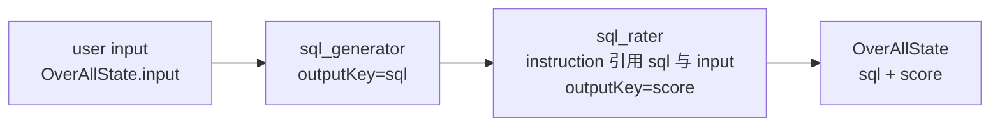
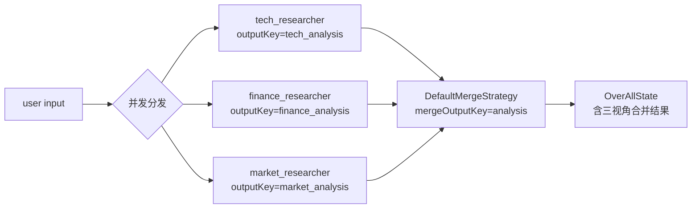
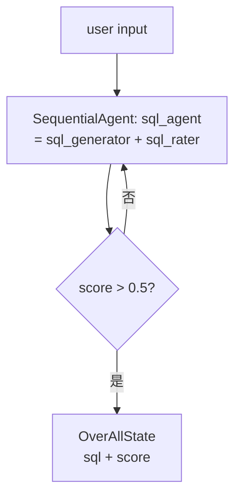
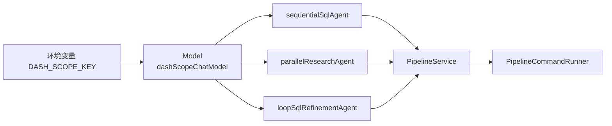
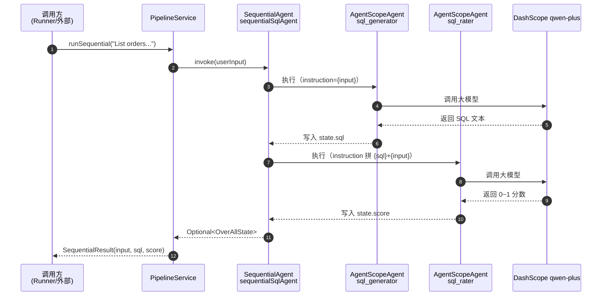
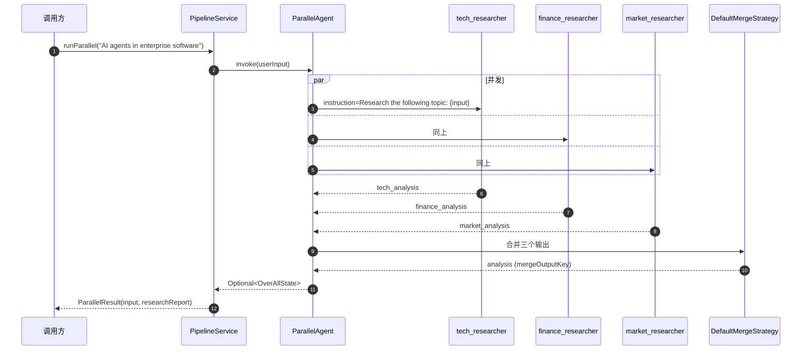
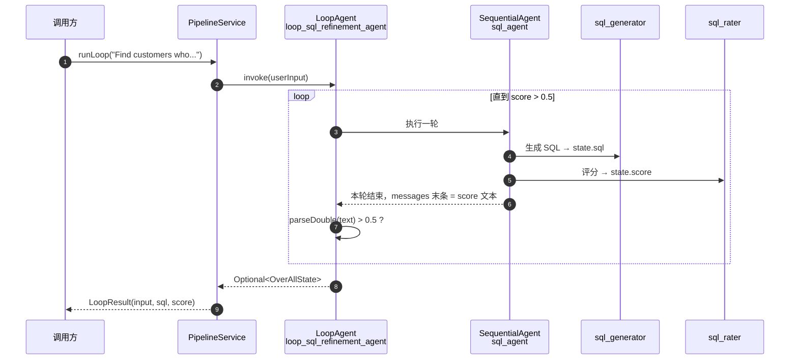

# Multi-Agent Pipeline 项目深度分析

> 项目路径：`agentscope/multiagent-patterns/pipeline/pipeline`
> 技术栈：Spring Boot 4.0.1 + Spring AI Alibaba 1.1.2.2 + AgentScope 1.0.10 + DashScope（通义千问）
> Java 版本：21
> 作者：coderpwh

---

## 一、项目定位与核心目标

本项目是一个 **多智能体（Multi-Agent）流水线（Pipeline）编排** 的示例工程，演示在 Spring AI Alibaba Graph + AgentScope 体系下，三种典型的多 Agent 协作模式：

| 模式 | 中文名 | 典型场景 | 项目中的示例 |
| --- | --- | --- | --- |
| **Sequential** | 顺序串行 | A 的输出 → B 的输入 | 自然语言 → 生成 SQL → 评分 |
| **Parallel** | 并发分支 | 多个 Agent 同时跑，再 merge | 同一主题做技术 / 金融 / 市场三视角研究 |
| **Loop** | 循环迭代 | 不达标就反复跑直到满足条件 | SQL 生成 + 评分，分数 > 0.5 才退出 |

它本质上是一个 **AI 编排框架的教科书级 Demo**：用一个统一的状态对象（`OverAllState`）在 Agent 之间传递键值（`input`、`sql`、`score`、`research_report`），通过不同的 FlowAgent（`SequentialAgent` / `ParallelAgent` / `LoopAgent`）控制执行拓扑。

---

## 二、整体架构图

```mermaid
flowchart TB
    subgraph SpringBoot["Spring Boot 启动层"]
        APP[PipelineApplication<br/>@SpringBootApplication]
        RDY[ApplicationReadyEvent Listener<br/>打印启动横幅]
        RUN[PipelineCommandRunner<br/>@ConditionalOnProperty]
        APP --> RDY
        APP --> RUN
    end

    subgraph Config["Bean 配置层 @Configuration"]
        MODEL[PipelineModelConfig<br/>DashScopeChatModel - qwen-plus]
        SEQCFG[SequentialPipelineConfig<br/>sequentialSqlAgent]
        PARCFG[ParallelPipelineConfig<br/>parallelResearchAgent]
        LOOPCFG[LoopPipelineConfig<br/>loopSqlRefinementAgent]
        RUNCFG[PipelineRunnerConfig<br/>PipelineService Bean]
    end

    subgraph Service["业务服务层"]
        SVC[PipelineService<br/>统一 invoke + 抽取结果]
        SR[SequentialResult]
        PR[ParallelResult]
        LR[LoopResult]
        SVC --> SR
        SVC --> PR
        SVC --> LR
    end

    subgraph AgentLayer["AgentScope / Spring-AI-Alibaba 内核"]
        SEQ[SequentialAgent]
        PAR[ParallelAgent]
        LOOP[LoopAgent]
        REACT[ReActAgent<br/>+ InMemoryMemory]
        STATE[(OverAllState<br/>键值状态总线)]
        SEQ --> STATE
        PAR --> STATE
        LOOP --> STATE
        REACT --> STATE
    end

    MODEL -.注入.-> SEQCFG
    MODEL -.注入.-> PARCFG
    MODEL -.注入.-> LOOPCFG
    SEQCFG -.产出 Bean.-> SEQ
    PARCFG -.产出 Bean.-> PAR
    LOOPCFG -.产出 Bean.-> LOOP
    SEQ -.注入.-> RUNCFG
    PAR -.注入.-> RUNCFG
    LOOP -.注入.-> RUNCFG
    RUNCFG --> SVC
    RUN --> SVC
```

---

## 三、源码目录与职责一览

```
src/main/java/com/coderpwh
├── PipelineApplication.java          # 启动主类 + 就绪事件横幅
├── PipelineCommandRunner.java        # 命令行 Runner（demo 调用入口）
├── config
│   ├── PipelineModelConfig.java      # 大模型 Bean：DashScope qwen-plus
│   └── PipelineRunnerConfig.java     # 装配 PipelineService
├── service
│   └── PipelineService.java          # 统一封装三种 invoke + 结果 record
├── sequential
│   └── SequentialPipelineConfig.java # 顺序模式 Agent 装配
├── parallel
│   └── ParallelPipelineConfig.java   # 并行模式 Agent 装配
└── loop
    └── LoopPipelineConfig.java       # 循环模式 Agent 装配
src/main/resources
└── application.yml                   # apiKey、pipeline.runner.enabled 开关
pom.xml                               # SpringBoot 4.0.1 + spring-ai-alibaba BOM
```

---

## 四、核心知识点拆解

### 4.1 Spring Boot 启动与启动横幅

`PipelineApplication.java` 注册了一个 `ApplicationListener<ApplicationReadyEvent>` Bean。

**关键点**
- `@SpringBootApplication` = `@Configuration` + `@EnableAutoConfiguration` + `@ComponentScan`。
- `ApplicationReadyEvent` 是 Spring Boot 应用完全启动后（包括 `ApplicationRunner` / `CommandLineRunner` 执行后）才发出的事件，适合做启动后的最终通告。
- 与 `ApplicationRunner` 的执行先后：`ApplicationRunner.run()` 早于 `ApplicationReadyEvent`。

### 4.2 ApplicationRunner + 条件装配

`PipelineCommandRunner` 实现了 `ApplicationRunner`，并用 `@ConditionalOnProperty(name = "pipeline.runner.enabled", havingValue = "true")` 受控启用。

**关键点**
- 配置文件中 `pipeline.runner.enabled: true` 决定该 Runner 是否注册为 Bean。
- 当前 `run()` 方法是空壳（只打了一行日志），三个 `runXxxDemo()` 私有方法已经写好但**未在 run 中真正调用**——这是一个明显的"接好了开关、留好了入口、待用户在 run 中按需触发"的模板。
- `truncate()` 工具方法用于报告类输出的安全截断（避免日志过长）。

### 4.3 OverAllState：跨 Agent 的"状态总线"

整个项目的数据流都靠 `OverAllState` 这一个对象在 Agent 之间传递。

**约定的键（PipelineService 中定义为常量）**

| 键 | 写入方 | 读取方 |
| --- | --- | --- |
| `input` | 入参 | 所有 Agent |
| `sql` | `sql_generator` | `sql_rater` / 结果抽取 |
| `score` | `sql_rater` | 结果抽取 / Loop 退出条件 |
| `tech_analysis` / `finance_analysis` / `market_analysis` | 三个 researcher | merge 合并器 |
| `analysis` | ParallelAgent merge 输出 | （示例中未读取，作为合并产物） |
| `research_report` | 项目读取键（实际由内核组合产生） | 结果抽取 |

> 说明：`ParallelAgent.mergeOutputKey("analysis")` 与 service 中读取的 `research_report` 字段名不一致，是该 Demo 的一个**小瑕疵**（详见第七节"潜在改进点"）。

### 4.4 Agent 三件套：ReActAgent / AgentScopeAgent / 内存

每个**叶子 Agent**（真正调大模型的那种）都由两层 Builder 组成：

```text
io.agentscope.core.ReActAgent.Builder      <- 定义"思考-行动"循环 + sysPrompt + memory
        │
        ▼
com.alibaba.cloud.ai.agent.agentscope.AgentScopeAgent.fromBuilder(...)
        │
        ├── instruction("{input}")        <- 用占位符引用 OverAllState 中的键
        ├── includeContents(false)        <- 是否把上下文消息一起注入
        └── outputKey("sql")              <- 输出写回 OverAllState 的哪个键
```

**关键点**
- `ReActAgent` = Reasoning + Acting 范式：模型先"思考"再"行动"（必要时调工具）。
- `InMemoryMemory` 是每个叶子 Agent 各自的对话历史（互不共享）。
- `instruction` 模板字符串中 `{input}`、`{sql}` 等占位符会在运行时由内核从 `OverAllState` 取值替换 —— 这是 Pipeline 的"数据流核心"。
- `outputKey` 决定该 Agent 的最终输出回写到状态总线的哪个键。

### 4.5 FlowAgent 三种模式

#### (1) SequentialAgent —— 顺序串行



- `subAgents(List.of(sqlGenAgent, sqlRatingAgent))` 顺序执行。
- 第二个 Agent 的 instruction 显式引用 `{sql}` + `{input}`，体现"流"的串联。

#### (2) ParallelAgent —— 并发分支 + 合并



- `maxConcurrency(3)`：最大并发度 = 3，刚好对应 3 个 researcher。
- `mergeStrategy(new ParallelAgent.DefaultMergeStrategy())`：默认把各分支输出拼接进 `mergeOutputKey`。

#### (3) LoopAgent —— 条件循环



- 内部包了一个 `SequentialAgent`（生成 + 评分两步算一轮），作为单次循环体。
- `LoopMode.condition(messages -> ...)`：每轮结束读取最新一条消息文本，解析为 `double`，**大于 0.5** 才退出循环；解析失败按继续循环处理。
- 阈值常量 `QUALITY_THRESHOLD = 0.5`。

### 4.6 Bean 装配顺序（DI 拓扑）



> 注：`application.yml` 里读 `${AI_DASHSCOPE_API_KEY:}`，但 `PipelineModelConfig` 实际读 `System.getenv("DASH_SCOPE_KEY")`。**两者名字不一致**，详见第七节。

### 4.7 配置项与外部依赖

`application.yml`：
```yaml
spring:
  application:
    name: multi-agent-pipeline
  ai:
    dashscope:
      api-key: ${AI_DASHSCOPE_API_KEY:}
pipeline.runner.enabled: true
```

`pom.xml` 关键依赖：
- `spring-boot-starter`
- `spring-ai-alibaba-starter-agentscope`
- 通过 BOM `spring-ai-alibaba-bom:1.1.2.2` 统一管理版本

仓库源：`repo.spring.io/milestone` + `oss.sonatype.org/snapshots` —— 说明使用的是里程碑 / 快照版本，并非稳定 GA。

---

## 五、典型调用流程（端到端时序图）

### 5.1 Sequential 模式



### 5.2 Parallel 模式



### 5.3 Loop 模式



---

## 六、知识点速查表

| 主题 | 用到的 API / 概念 | 在本项目中的体现 |
| --- | --- | --- |
| Spring Boot 启动事件 | `ApplicationReadyEvent`、`ApplicationListener` | `PipelineApplication` 的横幅 Bean |
| 条件装配 | `@ConditionalOnProperty` | `PipelineCommandRunner` 通过 `pipeline.runner.enabled` 受控 |
| 配置驱动 | `application.yml` + 环境变量占位 | `${AI_DASHSCOPE_API_KEY:}` |
| Bean 装配 | `@Configuration` + `@Bean` | 4 个 Config 类按职责拆分 |
| Java 17 Records | `record` 关键字 | `SequentialResult` / `ParallelResult` / `LoopResult` |
| 多行字符串 | Text Blocks `"""` | 所有 sysPrompt 都使用 |
| ReAct 范式 | `ReActAgent` + `InMemoryMemory` | 每个叶子 Agent 都用 |
| 状态总线 | `OverAllState` + `outputKey` | 跨 Agent 数据流 |
| 模板替换 | `instruction("{input}")` | Agent 之间的输入拼接 |
| 顺序编排 | `SequentialAgent.builder().subAgents(...)` | SQL 生成 → 评分 |
| 并发编排 | `ParallelAgent` + `maxConcurrency` + `mergeStrategy` | 三视角研究合并 |
| 循环编排 | `LoopAgent` + `LoopMode.condition(...)` | SQL 质量打磨 |
| 大模型客户端 | `DashScopeChatModel` (qwen-plus) | `PipelineModelConfig` |
| 日志 | SLF4J Logger | Runner / LoopConfig 中 |
| 字符串安全截断 | `truncate(s, maxLen)` | 控制并行结果输出长度 |

---

## 七、潜在改进点（代码审视）

> 以下不是"必须修"，而是基于阅读体感与一致性原则的小建议，方便你判断是否要打磨。

1. **API Key 来源不一致**
   - `application.yml` 期望 `AI_DASHSCOPE_API_KEY`
   - `PipelineModelConfig` 实际读 `System.getenv("DASH_SCOPE_KEY")`
   - 建议二选一并统一，或改为读 `spring.ai.dashscope.api-key` 配置项注入。

2. **mergeOutputKey 与 service 取键不一致**
   - `ParallelPipelineConfig` 写入 `analysis`
   - `PipelineService.runParallel` 读 `research_report`
   - 若依赖框架内部还会再写一个 `research_report` 则没问题；否则 `report` 会为 `null`。建议统一为同一个键，或在 service 端读 `analysis`。

3. **Runner 已写好却未触发 demo**
   - `runSequentialDemo()` / `runParallelDemo()` / `runLoopDemo()` 都是 `private` 且未在 `run()` 中调用。
   - 如果原意是启动即跑 demo，可在 `run(args)` 里按需调用；否则可以删除或者改为通过命令行参数选择运行哪一个。

4. **`PipelineService` 没有任何 `@Service` 或 `@Component` 注解**
   - 当前是依赖 `PipelineRunnerConfig#pipelineService` 这个 `@Bean` 方法装配，这是 OK 的；但风格上分散。
   - 可选：直接给 `PipelineService` 加 `@Service`，并移除 `PipelineRunnerConfig` 中的 `@Bean`，简化一层。

5. **LoopAgent 缺少最大迭代次数兜底**
   - 当前只有一个"分数 > 0.5"的退出条件；当大模型一直产出无法解析的分数（异常分支返回 `false`），理论上会一直循环。
   - 建议添加 `maxIterations` 之类的硬上限（若框架支持），或在 `catch` 分支累加失败次数。

6. **Sequential 的 sql_rater 没有 sysPrompt 写明"输出只允许数字"的失败兜底**
   - 与 Loop 类似，下游的 parseDouble 是脆弱的；如果上游产出包括前后空格或解释文字会 fail。
   - 可在 prompt 中再强调 + 在 service 解析时加 `trim()` 与正则提取。

7. **`PipelineApplication` 的横幅日志使用 `System.out.println`**
   - 与其他文件用 SLF4J 风格不一致；若启用 JSON 日志或 ELK 收集会丢失结构化字段。

---

## 八、如何运行

1. 设置环境变量（与 `PipelineModelConfig` 当前实现保持一致）：
   ```bash
   export DASH_SCOPE_KEY=your_dashscope_api_key
   ```
2. 启动：
   ```bash
   mvn spring-boot:run
   ```
3. 看到横幅即代表三个 Agent Bean 都已成功装配。
4. 如需运行 demo，在 `PipelineCommandRunner.run()` 中调用 `runSequentialDemo()` / `runParallelDemo()` / `runLoopDemo()` 即可。

---

## 九、一句话总结

> 这个项目用 **Spring AI Alibaba 的 FlowAgent**（Sequential / Parallel / Loop）+ **AgentScope 的 ReActAgent** 演示了"如何用一份统一的状态对象（`OverAllState`）+ 一套 `outputKey` 约定，把多 Agent 编排成串行、并行、循环三种典型协作拓扑"，是理解 Multi-Agent Pipeline 编排范式的最小可运行样本。

---

## 十、项目用到的 Spring AI Alibaba 内容详解

下面把项目里**真正用到的 Spring AI Alibaba**点列清楚（基于源码中 `com.alibaba.cloud.ai.*` 的实际 import 与调用点）。

### 10.1 依赖入口（`pom.xml`）

| 坐标 | 作用 |
| --- | --- |
| `com.alibaba.cloud.ai:spring-ai-alibaba-bom:1.1.2.2` | BOM 统一版本 |
| `com.alibaba.cloud.ai:spring-ai-alibaba-starter-agentscope` | 引入 AgentScope 适配器 + Graph 编排内核 |

### 10.2 Graph 编排内核（`com.alibaba.cloud.ai.graph.*`）

| API | 出现位置 | 在本项目里的用途 |
| --- | --- | --- |
| `OverAllState` | `PipelineService.java`（`state.value("sql")` 等） | 跨 Agent 的**状态总线**——所有 Agent 共享的键值容器（`input` / `sql` / `score` / `research_report`） |
| `exception.GraphRunnerException` | `PipelineService` 三个 `runXxx()` 方法的 `throws`；`PipelineCommandRunner.runLoopDemo` 的 catch | Agent 调用失败时抛出的领域异常 |
| `exception.GraphStateException` | `PipelineCommandRunner` 顶部 import（实际未使用，可清理） | 状态异常类 |

### 10.3 FlowAgent —— 三种编排模式（`com.alibaba.cloud.ai.graph.agent.flow.agent.*`）

这是项目最核心的部分，三种模式各对应一个 Builder：

| 类 | 出现位置 | 关键方法 |
| --- | --- | --- |
| `SequentialAgent` | `SequentialPipelineConfig`、`LoopPipelineConfig`（内嵌一层） | `builder().name().description().subAgents(List.of(...)).build()` |
| `ParallelAgent` | `ParallelPipelineConfig` | `builder().subAgents(...).mergeStrategy(new ParallelAgent.DefaultMergeStrategy()).mergeOutputKey("analysis").maxConcurrency(3).build()` |
| `LoopAgent` | `LoopPipelineConfig` | `builder().subAgent(sqlAgent).loopStrategy(LoopMode.condition(messages -> ...)).build()` |
| `loop.LoopMode` | `LoopPipelineConfig` | `LoopMode.condition(...)` 提供基于"末条消息文本"的循环退出判定 |
| `ParallelAgent.DefaultMergeStrategy`（内部类） | `ParallelPipelineConfig` | 默认合并策略，把多分支结果汇入 `mergeOutputKey` |

调用方式都是 **`.invoke(userInput)` → 返回 `Optional<OverAllState>`**（见 `PipelineService` 的三段实现）。

### 10.4 AgentScope 适配器（`com.alibaba.cloud.ai.agent.agentscope.*`）

| API | 出现位置 | 用途 |
| --- | --- | --- |
| `AgentScopeAgent` | 三个 Pipeline Config 里的每个叶子 Agent | 把 AgentScope 原生的 `ReActAgent.Builder` **桥接**进 Spring AI Alibaba 的 Graph 体系 |
| `AgentScopeAgent.fromBuilder(reActBuilder)` | 同上 | 接收一个 `ReActAgent.Builder` |
| `.name(...) / .description(...)` | 同上 | Agent 元信息 |
| `.instruction("{input}")` | 同上 | **模板字符串**，占位符在运行时由内核从 `OverAllState` 取值替换 |
| `.includeContents(false)` | 同上 | 是否把历史上下文消息一并注入 |
| `.outputKey("sql")` | 同上 | 该 Agent 的输出写回 `OverAllState` 的哪个键 |
| `.build()` | 同上 | 产出可被 FlowAgent 装配的子 Agent |

### 10.5 它**没**用的 Spring AI Alibaba 内容（容易混淆）

- ❌ 没用 `ChatClient` / `ChatModel` 直接调用大模型——大模型客户端走的是 AgentScope 的 `io.agentscope.core.model.DashScopeChatModel`，**不是** Spring AI Alibaba 的 DashScope starter。
- ❌ 没用 Spring AI Alibaba 的 `Advisor` / `Memory` 体系——记忆走的是 AgentScope 的 `io.agentscope.core.memory.InMemoryMemory`。
- ❌ 没用 Spring AI Alibaba 的 `Tool` / `Function Calling` 注解。
- ❌ 没用 Spring AI Alibaba 的 RAG、向量库、Embedding 模块。
- ❌ 没用 Spring AI Alibaba Graph 的低层 API（`StateGraph` / `Node` / `Edge`）——项目走的是更高一层的 **FlowAgent 三件套**，对用户屏蔽了图结构。

### 10.6 一句话归纳

> 项目对 Spring AI Alibaba 的使用聚焦在两件事：**(1) 用 `SequentialAgent / ParallelAgent / LoopAgent` 三种 FlowAgent 做编排拓扑**，**(2) 用 `AgentScopeAgent` 作为适配器把 AgentScope 的 `ReActAgent` 装进这套编排体系**，中间靠 `OverAllState` + `outputKey` 做数据流。其它 Spring AI Alibaba 的能力（Advisor / Tool / RAG / 直接 ChatClient 调用）本项目都没碰。
