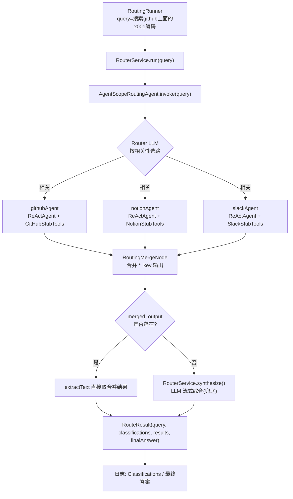
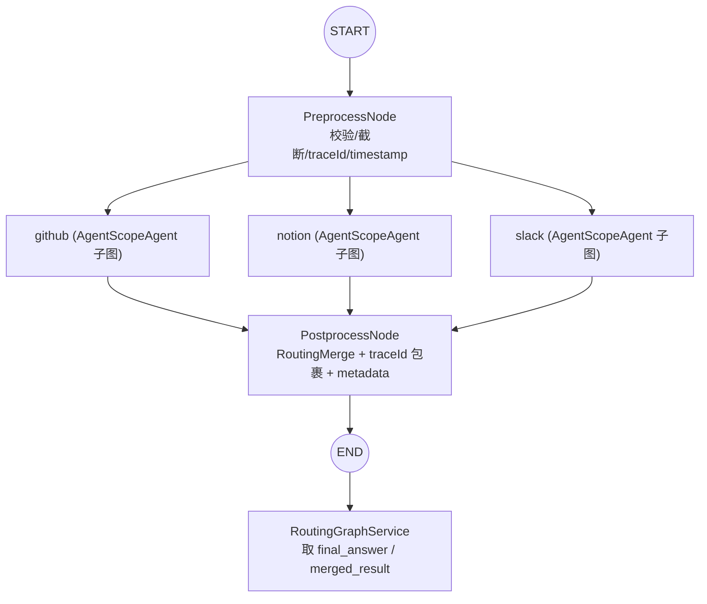

# Routing 模块：`graph` 与 `simple` 两种实现对比文档

> 模块路径：`agentscope/multiagent-patterns/routing/routing`
> 模式主题：多智能体「路由（Routing）」模式 —— 把一个问题路由到一个或多个领域专家智能体（GitHub / Notion / Slack），各自基于工具检索后，再合并/综合成最终答案。
> 文档日期：2026-05-17

---

## 0. 当前状态速览（结合控制台）

| 实现 | 包路径 | 代码状态 | 是否参与启动 |
|---|---|---|---|
| **simple** | `com.coderpwh.routing.simple` | ✅ 完整可编译、生效 | ✅ 通过 `RoutingRunner` 在启动时自动运行 |
| **graph** | `com.coderpwh.routing.graph` | ❌ **整包逐行注释**（每个 `.java` 文件全部 `//`） | ❌ 不编译、不加载、无任何运行时行为 |

- `graph` 包被注释由提交 `5a5f20a fix:注释graph` 引入，包含 `RoutingGraphConfig`、`RoutingGraphRunner`、`RoutingGraphService`、`PreprocessNode`、`PostprocessNode` 以及 3 个 `*StubTools`，**全部处于注释状态**，因此目前是「设计存档 / 备选方案」，并非运行代码。
- 启动时实际生效的链路是 **simple**：`RoutingApplication` → Spring Boot 启动 → `RoutingRunner`（`@ConditionalOnProperty routing.runner.enabled=true`，`application.yaml` 中为 `true`）→ `RouterService.run(query)`。
- 控制台预期输出（来自 `RoutingRunner` 的 SLF4J 日志）：

  ```text
  问题:搜索github上面的x001编码
  Routed to N sources: [...]            # 来自 RouterService.log
  Classifications:
    github: ...
  ---
  最终答案:...
  ```

> ⚠️ `RoutingApplication.applicationReadyEventApplicationListener(...)` 里的「启动成功 / 路由图示例已经启动了」横幅**不会打印**——该方法没有 `@Bean` 注解，Spring 不会注册这个监听器（见第 7 节）。

---

## 1. 公共技术栈（两实现共享）

| 维度 | 选型 |
|---|---|
| 语言 / JDK | Java 17（`java.version=17`；但 `maven-compiler-plugin` 的 `source/target=16`，存在版本不一致） |
| 框架 | Spring Boot **4.0.1**（`spring-boot-starter`） |
| AI 编排 | Spring AI Alibaba BOM **1.1.2.2**（`spring-ai-alibaba-starter-agentscope`） |
| Agent 运行时 | AgentScope Core（`io.agentscope.core.*`：`ReActAgent`、`InMemoryMemory`、`Toolkit`、`Model`） |
| 大模型 | 阿里云 DashScope，模型 `qwen-plus`（`DashScopeChatModel`） |
| 构建 | Maven（`spring-boot-maven-plugin`），仓库含 Spring Milestones + Sonatype Snapshots |
| 序列化 | Jackson（`@JsonCreator` / `@JsonProperty` 用于 record） |
| 日志 | SLF4J（`LoggerFactory`） |

---

## 2. 技术栈差异对比

| 维度 | **simple** | **graph** |
|---|---|---|
| 核心编排 API | `AgentScopeRoutingAgent`（高层「路由 Agent」封装，内部完成选路+并行+合并） | `StateGraph` / `CompiledGraph`（低层显式图编排） |
| 路由决策方式 | **LLM 动态选路**：由 router agent 根据 query 相关性决定调用哪些子 agent | **静态全量扇出**：`preprocess` 通过固定边连到 github/notion/slack，**无条件全部调用**（图里并未接入 router） |
| 状态管理 | 框架内部 `OverAllState`，业务侧只读取 output key | 显式 `KeyStrategyFactory`：`ReplaceStrategy`（input/query/各 key）+ `AppendStrategy`（messages） |
| 结果合并 | `RoutingMergeNode` + `RouterService.synthesize()`（LLM 流式综合，带兜底） | `RoutingMergeNode` + `PostprocessNode` 文本格式化（无 LLM 二次综合） |
| 前置处理 | 无（直接把原始 query 交给 router） | `PreprocessNode`：空值/长度校验、>2000 截断、生成 `traceId`+`timestamp`、构造 messages |
| 后置处理 / 可观测 | 仅日志 `Routed to N sources` | `PostprocessNode`：traceId 包裹、生成时间戳、`postprocess_metadata`（resultLength 等） |
| API Key 获取 | `RoutingConfig` 用 `System.getenv("AI_DASHSCOPE_API_KEY")`（环境变量，未硬编码） | 注释代码里同为 `System.getenv("AI_DASHSCOPE_API_KEY")`（环境变量） |
| 依赖注入 | Spring `@Bean` + `@Qualifier`，`Model` 作为 Bean 注入子 agent | 同为 `@Bean`，但 `Model` 由私有静态方法 `dashScopeModel()` 直接 new（非 Bean） |
| 入口 | `RoutingRunner`（`@ConditionalOnProperty` 受配置开关控制） | `RoutingGraphRunner`（无条件开关） |

---

## 3. 架构 / 流程图

### 3.1 simple —— LLM 动态路由（当前生效）



要点：

- 调用链 `RoutingRunner → RouterService → AgentScopeRoutingAgent`，选路、并行执行、合并都由框架的 `AgentScopeRoutingAgent` 在 `invoke()` 内部完成。
- `RouterService` 负责**结果落地**：`collectClassifications()` / `collectAgentOutputs()` 遍历 `{github_key, notion_key, slack_key}` 抽取被路由命中的来源；优先用 `RoutingMergeNode.DEFAULT_MERGED_OUTPUT_KEY` 的合并结果，缺失时回退到 `synthesize()` 用 `qwen-plus` 做去重/综合。
- 每个子 agent = `AgentScopeAgent.fromBuilder(ReActAgent)` + 独立 `Toolkit`（注册各自 Stub 工具）+ `InMemoryMemory` + `outputKey`。

### 3.2 graph —— 显式 StateGraph DAG（已注释，设计存档）



要点：

- 显式声明节点与边：`START → preprocess → {github, notion, slack} → postprocess → END`。
- **静态扇出**：`preprocess` 用固定边连到三个子 agent，**三个 agent 每次都会执行**（图中虽定义了 `routerAgent` Bean，但未接入图，等于不做选路）。这是与 simple 最本质的架构区别。
- 强调**确定性流程 + 可观测性**：前置校验（空/过短/超长截断）、`traceId`/`timestamp` 全程透传、后置 `postprocess_metadata` 记录长度等指标；通过 `KeyStrategyFactory` 显式控制每个状态 key 的合并策略（`messages` 用 `AppendStrategy`，其余 `ReplaceStrategy`）。
- 无 LLM 二次综合，`PostprocessNode` 只做模板化文本拼装。

---

## 4. 功能对比

| 功能点 | simple | graph |
|---|---|---|
| 输入校验（非空/最短 3 字符/超 2000 截断） | ❌ 无 | ✅ `PreprocessNode` |
| 路由选择 | ✅ LLM 按相关性**动态**选路（可只命中部分来源） | ❌ 无选路，**全量**调用三个来源 |
| 并行子 agent 执行 | ✅（框架内部） | ✅（图的并行分支） |
| 结果合并 | ✅ `RoutingMergeNode` | ✅ `RoutingMergeNode`（在 `PostprocessNode` 内） |
| 结果二次综合（去冗余/对齐口径） | ✅ `synthesize()`，LLM 流式 + 无结果兜底文案 | ❌ 仅模板拼接 |
| 分类结果回传（命中了哪些来源 + 子查询） | ✅ `List<Classification>` | ❌ 未单独输出 |
| 链路追踪 / 可观测 | ❌ 仅一行 `Routed to N sources` 日志 | ✅ `traceId` + `timestamp` + `*_metadata` |
| 运行开关 | ✅ `routing.runner.enabled` 配置控制 | ❌ 无开关 |
| 密钥安全 | ✅ 读环境变量 `AI_DASHSCOPE_API_KEY` | ✅ 读环境变量（注释代码） |
| 可运行性 | ✅ 立即可跑 | ❌ 全注释，不可运行 |

**一句话定位：**

- **simple**：以最少代码用框架高层 `AgentScopeRoutingAgent` 跑通「智能选路 + 综合」，重点在**省心**与**结果质量**（带 LLM 综合）。
- **graph**：用低层 `StateGraph` 换取**流程确定性 + 可观测性 + 校验**，但牺牲了动态选路（变成全量扇出）与代码量，目前停留在设计阶段。

---

## 5. 关键差异总结

1. **抽象层级不同**：simple 用「路由 Agent」黑盒（高层 API）；graph 用「状态图」白盒（低层 API，节点/边/状态策略全部显式）。
2. **路由语义相反**：simple 是「条件路由」（LLM 决定调谁，可少调）；graph 是「无条件扇出」（恒调全部，图里没接 router）。这是两者最容易被误解、也是最核心的功能差异。
3. **结果处理不同**：simple 有 LLM 二次综合与兜底；graph 只做带 traceId 的模板格式化。
4. **工程属性互补**：graph 提供 simple 缺失的输入校验、链路追踪、状态合并策略；simple 提供 graph 缺失的动态选路、综合质量、运行开关与即用性。
5. **共享的 4 件套**：两者均基于 `ReActAgent + Toolkit + InMemoryMemory + qwen-plus`，三类 Stub 工具（GitHub/Notion/Slack）逻辑一致（返回固定桩字符串），差异只在编排层。

---

## 6. 控制台行为分析

| 来源 | 输出 | 是否真的会打印 |
|---|---|---|
| Spring Boot | 标准启动 banner / 自动配置日志 | ✅ |
| `RoutingApplication` 自定义横幅（启动成功 / 路由图示例已经启动了） | `System.out` 4 行横幅 | ❌ **不会**（方法缺 `@Bean`，监听器未注册） |
| `RoutingRunner` | `问题:{query}` → `Classifications:` → `  {source}: {query}` → `---` → `最终答案:{...}` | ✅（`routing.runner.enabled=true`） |
| `RouterService` | `Routed to N sources: [...]` | ✅ |
| `graph` 相关 | 无 | ❌（整包注释） |

固定 demo query：`搜索github上面的x001编码`（`RoutingRunner` 第 27 行硬编码）。

---

## 7. 发现的问题与建议

1. **🟢 密钥管理（已合规）**：`RoutingConfig.java:45-46` 通过 `System.getenv("AI_DASHSCOPE_API_KEY")` 读取 DashScope API Key，源码与 Git 历史中均未出现硬编码 Key 字面量。运行前确保已设置环境变量 `AI_DASHSCOPE_API_KEY` 即可；建议后续可结合 `application.yaml` 占位符 + 环境变量注入做统一管理。
2. **🟠 启动横幅失效**：`RoutingApplication.applicationReadyEventApplicationListener(Environment)` 未加 `@Bean`，Spring 不会注册该 `ApplicationListener`，横幅永远不打印。补上 `@Bean` 即可生效。
3. **🟡 JDK 版本不一致**：`pom.xml` 中 `java.version=17`，但 `maven-compiler-plugin` 显式 `source/target=16`。建议统一为 17（或移除该插件配置，交给 Spring Boot parent 管理）。
4. **🟡 `dashscope.version=2.15.0` 属性悬空**：声明了属性但无对应依赖项引用，DashScope 实际由 starter 传递引入。建议删除无用属性，或显式锁定版本，避免误导。
5. **🟢 graph 包定位**：若 `graph` 是有意保留的备选实现，建议挪到独立模块/分支或加 `README` 说明「设计存档」；长期整包注释会随框架升级腐化（API 漂移后无法直接启用）。
6. **🟢 一致性建议**：若希望 graph 与 simple 行为对齐（带选路 + 综合），可在图中以条件边接入 `routerAgent`，并把 `synthesize()` 逻辑下沉为一个 `SynthesizeNode`，让两套实现可对照评测。

---

## 附：类清单

| 包 | 类 | 职责 | 状态 |
|---|---|---|---|
| `routing` | `RoutingApplication` | Spring Boot 入口（含失效的横幅监听器） | 生效 |
| `simple` | `RoutingConfig` | 定义 model / 3 子 agent / routerAgent / routerService Bean | 生效 |
| `simple` | `RouterService` | 调用 routing agent、收集分类与输出、综合最终答案 | 生效 |
| `simple` | `RoutingRunner` | 启动时跑 demo query 并打印结果 | 生效（受开关） |
| `simple.state` | `Classification` / `AgentOutput` | Jackson record，承载来源与结果 | 生效 |
| `simple.tools` | `GitHubStubTools` / `NotionStubTools` / `SlackStubTools` | 桩工具，返回固定检索文本 | 生效 |
| `graph` | `RoutingGraphConfig` | StateGraph 装配（preprocess→3 agent→postprocess） | 注释 |
| `graph` | `RoutingGraphRunner` / `service.RoutingGraphService` | 入口 / 图调用与结果抽取 | 注释 |
| `graph.node` | `PreprocessNode` / `PostprocessNode` | 前置校验+traceId / 后置格式化+metadata | 注释 |
| `graph.tools` | `GitHubStubTools` / `NotionStubTools` / `SlackStubTools` | 同 simple 桩工具 | 注释 |
