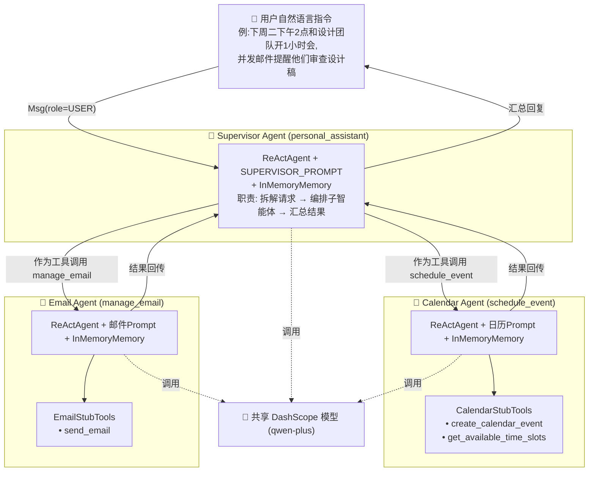
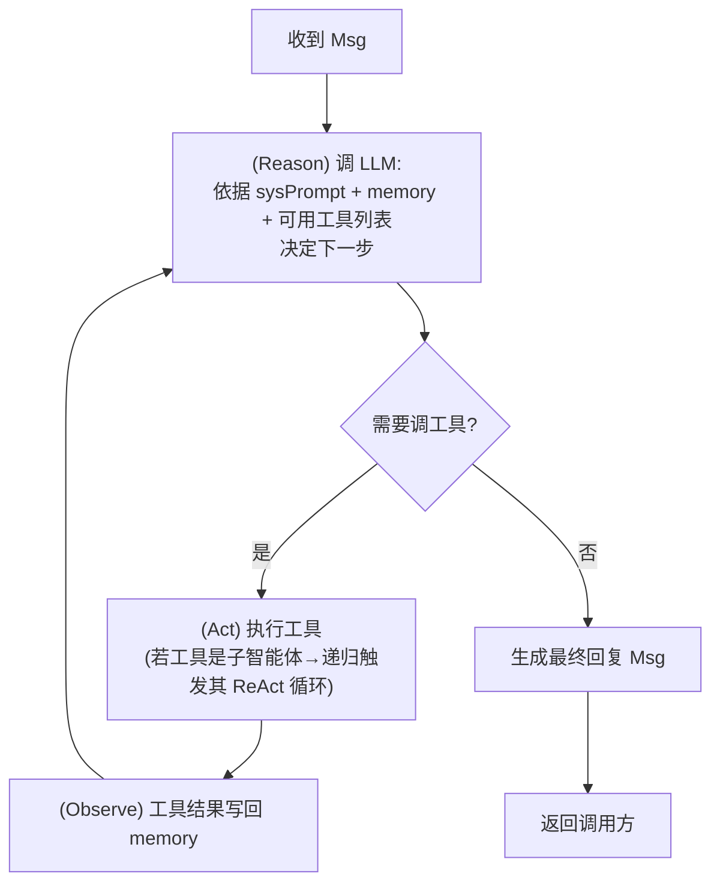
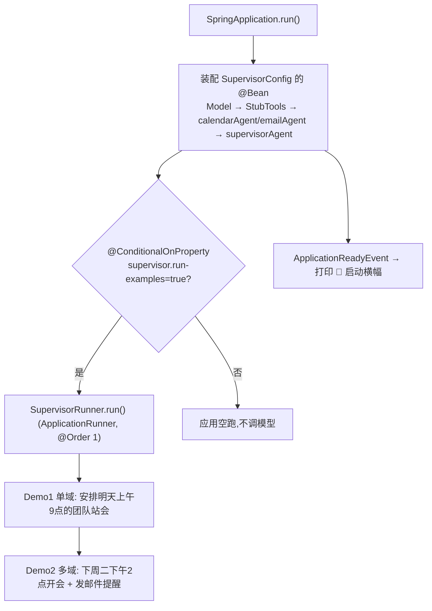
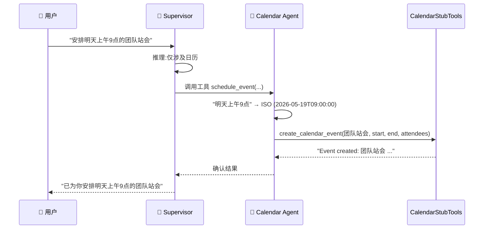
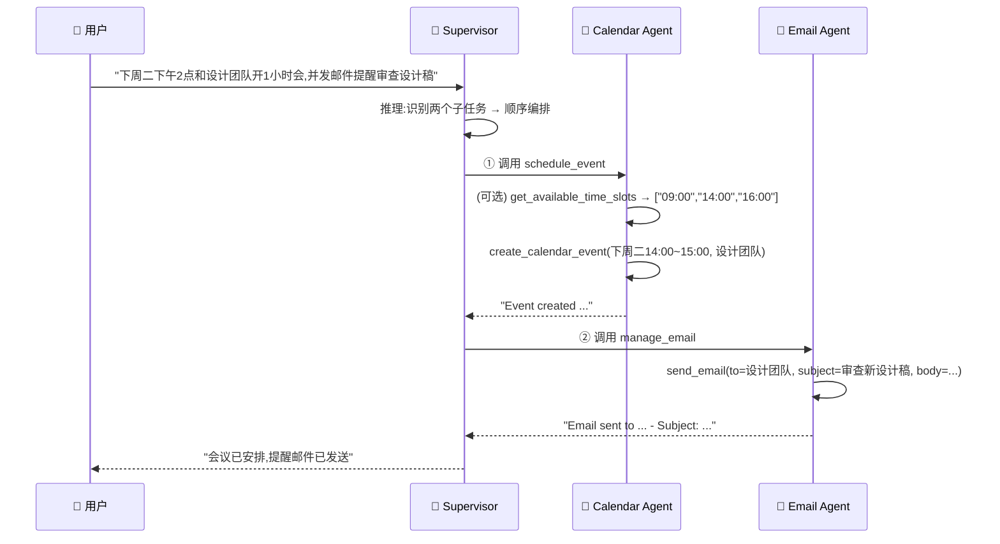

# Supervisor 多智能体模式 — 架构与知识点梳理

> 基于 **AgentScope + Spring AI Alibaba** 的「Supervisor（主管 / 编排者）多智能体」示例项目。
> 本文从架构、流程、业务、设计模式等多维度系统梳理代码涉及的知识点。

---

## 一、项目概览

| 项 | 内容 |
|---|---|
| 项目名 | `supervisor` — 个人助理（personal assistant） |
| 业务场景 | 用自然语言下达指令 → AI 自动「安排日程」+「发送邮件」 |
| 核心模式 | **Supervisor Pattern（主管模式 / Agents-as-Tools 智能体即工具）** |
| 框架 | Spring Boot 4.0.1 + Spring AI Alibaba 1.1.2.2 + AgentScope（`io.agentscope.core`） |
| 大模型 | 阿里云百炼 DashScope —— `qwen-plus`（通义千问） |
| 启动方式 | Spring Boot 启动后由 `ApplicationRunner` 自动跑两个 Demo |

---

## 二、技术栈与依赖

```
Java 17 (编译 target 16)
│
├── spring-boot-starter ............... Spring Boot 基础容器 / IoC / 生命周期
│
└── spring-ai-alibaba-starter-agentscope
        ├── io.agentscope.core.ReActAgent .............. ReAct 智能体
        ├── io.agentscope.core.tool.Toolkit ............ 工具集（含「智能体即工具」）
        ├── io.agentscope.core.model.DashScopeChatModel  通义千问模型
        ├── io.agentscope.core.memory.InMemoryMemory ... 内存对话记忆
        └── io.agentscope.core.message.Msg ............. 统一消息体（Reactive）
```

依赖通过 BOM 统一版本：`spring-boot-dependencies` + `spring-ai-alibaba-bom`，
仓库走 Spring Milestones / Sonatype Snapshots（使用预发布版本）。

---

## 三、整体架构图



**关键架构思想**：三个 `ReActAgent` 形成 **两层树状层级**。
子智能体（Calendar / Email）对主管而言，外观上就是一个「工具」
（`toolkit.registerTool(calendarAgent)`）。主管不需要知道日历内部如何解析时间，
它只管"调用工具"——这就是 **Agents-as-Tools**：用工具调用的统一接口实现智能体的递归编排。

---

## 四、核心知识点

### 1. Supervisor 多智能体模式（主线）

| 维度 | 说明 |
|---|---|
| 别名 | Orchestrator-Worker / Hierarchical Agents / Agents-as-Tools |
| 解决什么 | 单 Agent 工具过多 → 提示词臃肿、决策混乱；拆成「领域专精子智能体」+「总调度」 |
| 实现手段 | `Toolkit.registerTool(subAgent)` —— 把一个 Agent 当工具注册给上层 Agent |
| 优点 | 关注点分离、子智能体可独立演进 / 复用、提示词聚焦、易扩展 |
| 代价 | 多层 LLM 调用 → 延迟与 token 成本叠加；错误逐层传播 |

### 2. ReAct Agent 工作原理（Reasoning + Acting 循环）



**精妙之处**：当"工具"是子智能体时，`(Act)` 这一步实际上**触发了子智能体一整轮完整的 ReAct 循环**——递归嵌套。

### 3. Toolkit 工具注册机制

`Toolkit` 是 AgentScope 统一的工具容器，可注册两类对象：

- **普通工具对象**：`toolkit.registerTool(calendarStubTools)`
  通过 `@Tool` / `@ToolParam` 注解反射出函数 schema 暴露给 LLM。
- **智能体**：`toolkit.registerTool(calendarAgent)`
  Agent 的 `name`（如 `schedule_event`）+ `description`（如 `"Calendar scheduling assistant"`）
  即它作为工具时的函数名与说明，供上层 LLM 决策。

> 因此 `calendarAgent` / `emailAgent` **必须**设置 `.name()` 和 `.description()`——
> 它们要"伪装"成函数供主管 LLM 选择调用。

### 4. 工具定义：注解驱动（`@Tool` / `@ToolParam`）

```java
@Tool(name = "create_calendar_event",
      description = "Create a calendar event. Requires exact ISO datetime format.")
public String createCalendarEvent(
    @ToolParam(name="title",     description="Event title") String title,
    @ToolParam(name="startTime", description="ISO 格式, e.g. 2024-01-15T14:00:00") String startTime,
    @ToolParam(name="endTime",   ...) String endTime,
    @ToolParam(name="attendees", ...) List<String> attendees,
    @ToolParam(name="location",  required=false) String location) { ... }
```

- `@Tool` → 注册为 LLM 可见的 function，`description` 告诉模型"何时用我"。
- `@ToolParam` → 参数 schema，`description` 引导模型如何填参
  （prompt 与参数描述反复强调 **ISO 格式**，是引导 LLM 把"下周二下午2点"标准化的关键）。
- `required=false` → 可选参数（`location`、`cc`）。
- **Stub（桩）实现**：方法体不真正建日历 / 发邮件，仅 `String.format` 返回确认文本。
  这是**可演示而无副作用**的设计，重点在演示编排链路而非真实集成。

### 5. 模型集成（DashScope / 通义千问）

```java
@Bean
public Model dashScopeChatModel(@Value("${spring.ai.dashscope.api-key:}") String apiKey) {
    String key = StringUtils.hasText(apiKey) ? apiKey : System.getenv("AI_DASHSCOPE_API_KEY");
    return DashScopeChatModel.builder().apiKey(key).modelName("qwen-plus").build();
}
```

- **API Key 双通道兜底**：先读配置 `spring.ai.dashscope.api-key`，
  空则回退读环境变量 `AI_DASHSCOPE_API_KEY`。
- **单例共享**：一个 `Model` Bean 被三个 Agent 共用，节省连接、统一模型版本。

### 6. 记忆机制（InMemoryMemory）

每个 Agent 各自 `new InMemoryMemory()` —— 记忆是 **Agent 私有、进程内、非持久化**：

- 主管记忆 ≠ 子智能体记忆，彼此隔离（子智能体只看到主管转发的那条指令）。
- 重启即丢失；多用户 / 多会话场景需替换为带 sessionId 的持久化记忆实现。

### 7. 响应式编程模型（Reactive）

```java
Msg response1 = supervisorAgent.call(buildUserMsg(query1)).block();
```

- `agent.call(...)` 返回 **Reactive 流（Mono/Flux）**，`.block()` 转同步取结果（示例简化）。
- `Msg` 是统一消息体：`Msg.builder().role(MsgRole.USER).textContent(text).build()`。
- 生产环境应保留响应式链路（流式输出、背压），而非 `block()`。

### 8. Spring Boot 集成与启动生命周期



- `@ConditionalOnProperty`：开关控制是否跑 Demo，默认不开则不调模型（省钱 / 可控）。
- `@Qualifier`：容器里有 3 个 `ReActAgent` Bean，注入需用
  `@Qualifier("supervisorAgent")` 等消除歧义。

---

## 五、业务流程图

### 场景 A：单域请求 —— "安排明天上午9点的团队站会"



### 场景 B：多域请求 —— "开会 + 发邮件提醒"（编排核心展示）



> 场景 B 是项目**点睛之笔**：演示 Supervisor 如何把"一句复合指令"
> 拆成有序的多次子智能体调用并汇总——即**多智能体编排（orchestration）**。

---

## 六、关键类速查表

| 类 | 角色 | 关键点 |
|---|---|---|
| `SupervisorApplication` | 启动入口 | `@SpringBootApplication`；监听 `ApplicationReadyEvent` 打印横幅 |
| `SupervisorConfig` | 装配中心 | 定义 Model、2 个工具、3 个 Agent；3 段 Prompt 是"灵魂" |
| `SupervisorRunner` | 演示驱动 | `ApplicationRunner` + `@ConditionalOnProperty`，跑 2 个 Demo |
| `CalendarStubTools` | 日历工具桩 | `create_calendar_event` / `get_available_time_slots` |
| `EmailStubTools` | 邮件工具桩 | `send_email` |

**三段 Prompt 的设计意图**：

- 日历 Prompt：强制"自然语言 → ISO 标准时间"的归一化职责。
- 邮件 Prompt：强制"提取收件人 / 拟主题正文"的结构化职责。
- 主管 Prompt：强调"**拆解请求 + 按顺序协调多工具**"——编排能力的提示词锚点。

---

## 七、设计模式与亮点

1. **Agents-as-Tools（智能体即工具）**：统一工具接口实现智能体递归组合，核心范式。
2. **关注点分离**：日历 / 邮件各自专精，主管只负责"路由 + 编排"。
3. **Stub 桩设计**：无真实副作用，安全可演示，聚焦链路本身。
4. **配置开关化**：`run-examples` 开关 + API Key 双通道兜底，体现工程化考量。
5. **Spring IoC 编排依赖**：Bean 装配天然表达 Agent 拓扑（Model→Tools→子Agent→主管）。

---

## 八、值得注意 / 可改进点

- **`block()` 阻塞**：示例可接受，生产应保留响应式或做异步编排。
- **记忆不持久 & 不隔离会话**：`InMemoryMemory` 仅适合单人 Demo；多用户需 sessionId + 持久化。
- **桩工具不校验**：未校验时间合法性 / 邮箱格式（注释声称需要但未实现）。
- **错误处理缺失**：未见对 LLM 失败、工具异常、子智能体超时的兜底。
- **编译目标不一致**：`java.version=17` 但 compiler plugin 配 `source/target=16`，建议统一。
- **日志笔误**：`SupervisorRunner` 第二条日志 `"用户问题1{}"` 应为 `"用户问题2:{}"`。

---

## 九、如何扩展（举例）

新增一个"差旅 Agent"只需三步，无需改动现有 Agent：

1. 写 `TravelStubTools`（`@Tool` 注解方法，如 `book_flight`）。
2. 在 `SupervisorConfig` 加 `travelAgent` Bean（`.name("manage_travel")` + 专属 Prompt + 注册工具）。
3. 在 `supervisorAgent` 的 Toolkit 里 `toolkit.registerTool(travelAgent)`。

主管 LLM 会自动根据 `description` 学会在合适场景调用新子智能体——
**这正是 Supervisor 模式可扩展性的体现**。
